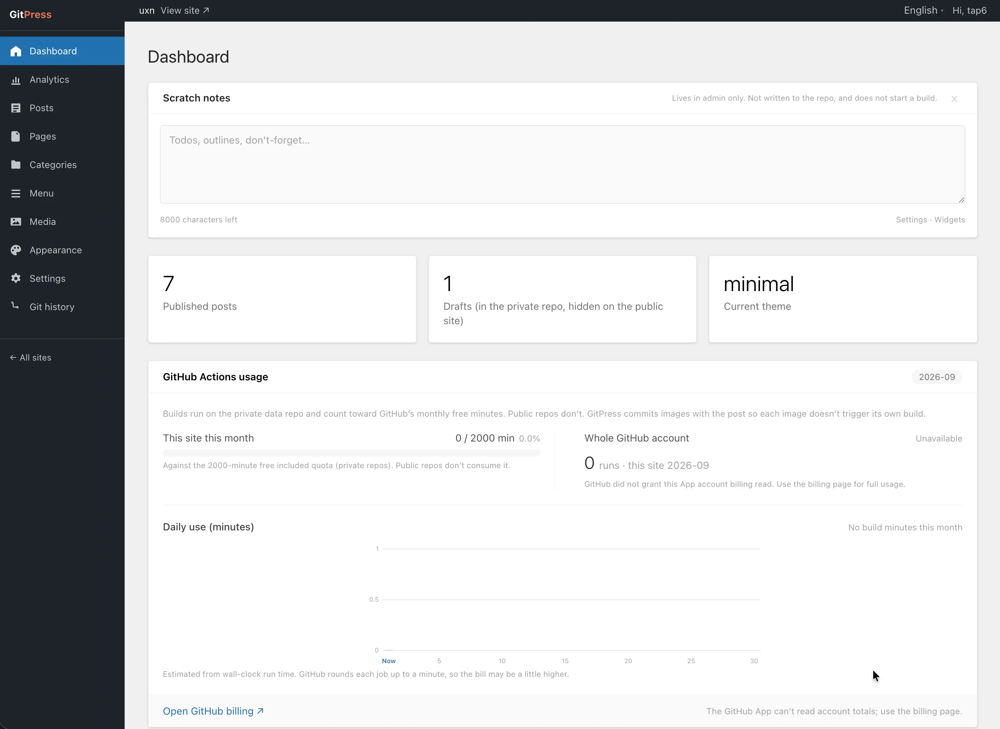

# GitPress.net

[](LICENSE)
[](https://gitpress.net)
[](https://github.com/tap6/GitPress.net/activity)

**GitPress is a blog admin: write like WordPress, keep posts on your own GitHub, and publish a static site on save.**

This repository is the source of [gitpress.net](https://gitpress.net) — the control plane you click every day — not your article library. Readers hit your GitHub Pages, not our servers.

[中文](README.md) | English



## The three pieces

| Repository | License | Role |
| --- | --- | --- |
| **This repo** [tap6/GitPress.net](https://github.com/tap6/GitPress.net) | [PolyForm Shield](LICENSES/PolyForm-Shield-1.0.0.md) | The site you use: control plane |
| [tap6/gitpress](https://github.com/tap6/gitpress) | [MIT](LICENSES/MIT.txt) | Builtin themes, `gitpress.json` spec, data-repo template |
| [tap6/build-action](https://github.com/tap6/build-action) | [MIT](LICENSES/MIT.txt) | Compile a private data repo into a public site repo |

If GitPress.net shuts down, your posts stay in your repos. Keep building with the same theme and `@v1` Action. You lose this admin, not the writing.

This monorepo is not OSI-open as a whole. The control plane is source-available: you may self-host for yourself, not run a competing public GitPress (even for free). Themes and the build action are MIT. There is no one-click Deploy; self-hosting is in [`docs/platform-setup.md`](docs/platform-setup.md).

## License

The binding text is in [`LICENSE`](LICENSE). If this summary conflicts, that file wins.

- **Control plane** (`apps/web` and related): PolyForm Shield 1.0.0. Read, change, and self-host. Offering it as a product or service to others (including free hosting, white-label, or open signup) needs a written grant. Ask via [Issues](https://github.com/tap6/GitPress.net/issues).
- **Themes / spec / build action / templates**: MIT, published as `tap6/gitpress` and `tap6/build-action`.
- The names “GitPress”, “GitPress.net”, gitpress.net, and the official 网安 badge are not licensed by the above.

## Architecture

```
Browser ── GitPress.net (Next.js on Vercel, PolyForm Shield)
                 │  GitHub App API (Markdown / images / config)
                 ▼
         Data repo (private) ── push ──▶ GitHub Actions (gitpress build-action)
         content/ media/ gitpress.json          │ Astro build, drafts excluded
                                                ▼
                                        Site repo (public, compiled output)
                                                │
                                                ▼
                                    GitHub Pages / Vercel
```

- **Data repo is private by default**: Markdown (including drafts), images, `gitpress.json`. Drafts never leave the private repo.
- **Site repo is public by default**: published pages only, so free GitHub Pages works.
- **Changing theme does not touch content**: theme and version are pinned in `gitpress.json`; rebuild to restyle.

## Layout

| Path | License | What |
| --- | --- | --- |
| `apps/web` | PolyForm Shield | GitPress.net (marketing + WordPress-style admin) |
| `packages/spec` | MIT | v1 spec: JSON Schema, frontmatter, TypeScript types |
| `packages/build-action` | MIT | GitHub Action: config → theme → Astro → push site repo |
| `themes/*` | MIT | Builtin Astro themes (classic / minimal / ink / quill) |
| `templates/data-repo` | MIT | Data-repo template |
| `docs/` | PolyForm Shield | Deploy and integration docs |

## Local development

```bash
pnpm install
cp apps/web/.env.example apps/web/.env.local
pnpm dev
```

Preview a theme with the sample content:

```bash
node packages/build-action/scripts/prepare-local.mjs themes/classic templates/data-repo
pnpm --filter @gitpress/theme-classic dev
```

## Compatibility

- Config files carry `schemaVersion`. The spec only adds fields; old ones are deprecated, not removed.
- Sites pin a theme version and Action major (`@v1`). Platform upgrades never rewrite user repos.
- Breaking changes ship only under a new major tag (`@v2`). Old sites keep building.

See [`packages/spec`](packages/spec) and [`docs/`](docs).
