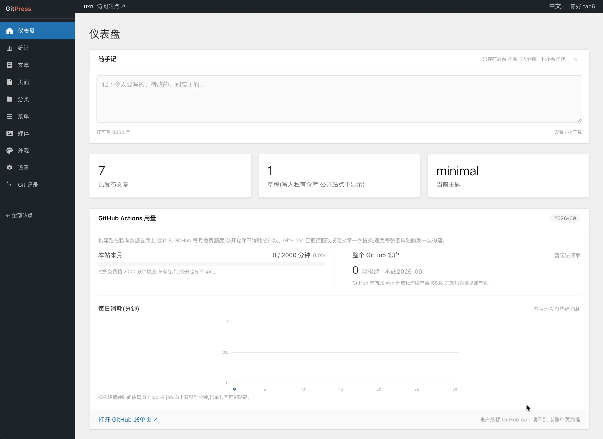

# GitPress.net

<p align="center">
  
</p>

[](LICENSE)
[](https://gitpress.net)
[](https://github.com/tap6/GitPress.net/activity)

**GitPress 是博客后台：像 WordPress 一样写文章，稿子在你自己的 GitHub 上，保存后变成静态网页。**

本仓是 [gitpress.net](https://gitpress.net) 你每天点的那个网站（控制面源码），不是文章库。读者打开的是你的 GitHub Pages，不是我们的服务器。

中文 | [English](README.en.md)



## 三块分别干什么

| 仓库 | 许可 | 做什么 |
| --- | --- | --- |
| **本仓** [tap6/GitPress.net](https://github.com/tap6/GitPress.net) | [PolyForm Shield](LICENSES/PolyForm-Shield-1.0.0.md) | 你每天点的网站：控制面 |
| [tap6/gitpress](https://github.com/tap6/gitpress) | [MIT](LICENSES/MIT.txt) | 内置主题、`gitpress.json` 约定、数据仓模板 |
| [tap6/build-action](https://github.com/tap6/build-action) | [MIT](LICENSES/MIT.txt) | 从私有数据仓编出静态站，推进公开网站仓 |

关停之后：稿子还在你的仓库里，用同一份主题和 `@v1` Action 继续编即可。少的是这个后台，不是文章。

这不是 OSI 意义上的「整仓开源」。后台源码公开，可以自己部署给自己用；不能拿去开另一个面向大家的 GitPress 平台（免费也不行）。主题和构建工具才是 MIT。没有一键 Deploy；自建见 [`docs/platform-setup.md`](docs/platform-setup.md)。

## 许可

正文见 [`LICENSE`](LICENSE)。若下面说明与正文冲突，以正文为准。

- **控制面**（`apps/web` 等）：PolyForm Shield 1.0.0。可读、可改、可自用；把后台做成面向他人的产品或服务（含免费托管、白标、开放注册）需要书面授权。商业授权请开 [Issue](https://github.com/tap6/GitPress.net/issues)。
- **主题 / 规范 / 构建 Action / 数据仓模板**：MIT。发布在 `tap6/gitpress` 与 `tap6/build-action`。
- 「GitPress」「GitPress.net」、gitpress.net 以及网安徽章不随上述许可再授权。

## 架构总览

```
用户浏览器 ── GitPress.net (Next.js on Vercel, PolyForm Shield)
                 │  GitHub App API(提交 Markdown / 图片 / 配置)
                 ▼
         数据仓库(私有)── push 触发 ──▶ GitHub Actions(gitpress build-action)
         content/ media/ gitpress.json          │ Astro 构建,排除草稿
                                                ▼
                                        网站仓库(公开,编译产物)
                                                │
                                                ▼
                                    GitHub Pages / Vercel 托管
```

- **数据仓库默认私有**:Markdown 文章(含草稿)、图片、`gitpress.json` 站点配置。草稿永远不出私有仓库。
- **网站仓库默认公开**:只有编译后的已发布页面,免费版 GitHub Pages 亦可用。
- **换主题不动内容**:主题与版本锁定在 `gitpress.json`,重新构建即可换肤。

## 目录结构

| 目录 | 许可 | 说明 |
| --- | --- | --- |
| `apps/web` | PolyForm Shield | GitPress.net 平台(官网 + WordPress 风格后台) |
| `packages/spec` | MIT | v1 规范:`gitpress.json` / `theme.json` JSON Schema、内容与 frontmatter 约定、TS 类型 |
| `packages/build-action` | MIT | GitHub Action:读配置 → 装主题 → Astro 构建 → 推送产物到网站仓库 |
| `themes/*` | MIT | 内置 Astro 主题(classic / minimal / ink / quill) |
| `templates/data-repo` | MIT | 数据仓库模板(目录结构 + workflow + 示例文章) |
| `docs/` | PolyForm Shield | 部署与接入文档 |

## 本地开发

```bash
pnpm install
cp apps/web/.env.example apps/web/.env.local   # 填入各项凭据
pnpm dev                                        # 启动 GitPress.net 平台
```

本地预览一个主题(使用模板里的示例内容):

```bash
node packages/build-action/scripts/prepare-local.mjs themes/classic templates/data-repo
pnpm --filter @gitpress/theme-classic dev
```

## 兼容性承诺

- 所有配置文件带 `schemaVersion`;规范只做加法,旧字段只废弃、不删除。
- 站点锁定主题版本与构建 Action 大版本(`@v1`),平台升级永不自动修改用户仓库。
- 破坏性变更只会出现在新的大版本标签(`@v2`),老站点永远能构建。

详见 [`packages/spec`](packages/spec) 与 [`docs/`](docs)。
